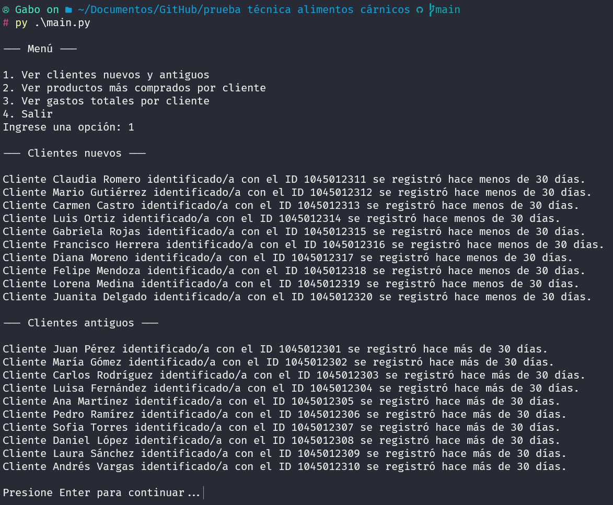

<h1 align="center">Caso Técnico - Practicante TI y Analítica</h1>

Alimentos cárnicos - Zenú

## Tabla de contenidos:

---

- [Descripción](#descripción)
- [Guía de usuario](#guía-de-usuario)
- [Solución](#solución)
- [Cómo contribuir](#cómo-contribuir)
- [Autor/es](#autores)
- [Información adicional](#información-adicional)

## Descripción

---

Desarrollo de prueba técnica para practicante con aspiraciones a trabajar para alimentos cárnicos. El enunciado con todos los pasos a seguir y requisitos necesarios para completar la prueba satisfactoriamente son los siguientes:

La jefatura nacional de ventas hoy requiere obtener la data para un nuevo desarrollo de analítica que contenga las siguientes características:

● Nombre “Nombre del cliente” 
● Cliente_Id “Identificador único del cliente” 
● Email “Correo electrónico” 
● Fecha de registro “Fecha de registro del cliente” 
● Compra_id “Identificador único de la compra” 
● Producto “Nombre del producto comprado” 
● Cantidad “Cantidad de productos comprados” 
● Precio “Precio del producto” 
● Fecha_compra “Fecha de la compra” 

[1](#1). Para cada uno de los campos antes mencionados, por favor define que tipo de datos debe de ser (ej: Char, Float, DateTime…). ✅ 
[2](#2). Identificar cuantas tablas debe de tener la base de datos y adjuntar el diagrama entidad relación, dar una breve descripción del diseño. ✅ 
[3](#3). Debe de proponer una aplicación que puedan utilizar los vendedores de la organización para realizar la captura de la data, mediante un dibujo realice de manera simple un diseño de interfaz del usuario. ✅

Como ya cuenta con una data de clientes por favor resuelva al menos dos de los siguientes enunciados y colocar una imagen del script o colocar el código desarrollado:

[4](#4). Escribe un script en Python que segmente a los clientes en dos grupos: "Nuevos" (clientes registrados en los últimos 30 días) y "Antiguos" (clientes registrados hace más de 30 días). ✅ 
[5](#5). Escribe un script en Python que identifique el producto más comprado por cada cliente. 
[6](#6). Escribe un script en Python que calcule el gasto total de cada cliente.

## Guía de usuario

---

## Solución

---

## 1

● Nombre “Nombre del cliente”: Tipo de dato string 
● Cliente_Id “Identificador único del cliente”: Tipo de dato int 
● Email “Correo electrónico”: Tipo de dato string 
● Fecha de registro “Fecha de registro del cliente”: Tipo de dato DateTime 
● Compra_id “Identificador único de la compra”: Tipo de dato int 
● Producto “Nombre del producto comprado”: Tipo de dato string 
● Cantidad “Cantidad de productos comprados”: Tipo de dato int 
● Precio “Precio del producto”: Tipo de dato float 
● Fecha_compra “Fecha de la compra”: Tipo de dato DateTime 

## 2

<strong>Descripción:<strong> El diseño propuesto toma en cuenta que para cada pedido debe existir un id del cliente que lo realizo, esta conexión se hace mediante la clave foránea que se encuentra en la tabla de pedidos. Los usuarios pueden realizar varios o ningún pedido, y los pedidos solo pertecen a un usuario.

El id del cliente será la cédula, ya que este es un documento único, no habría ningún problema por guardar esta información de manera manual y no automática.

## 3

<strong>Descripción:<strong> El diseño propuesto facilita a los vendedores el trabajo. Solicita primero que se escriba la cédula del cliente para buscar la información en la base de datos. Al dar click en el botón buscar el campo del nombre se autocompletará.

Para habilitar la opción de llenar la información de la factura es necesario que el cliente se encuentre registrado en la base de datos, la idea principal es evitar errores al intentar guardar información de un cliente que no esté en la tabla de clientes. El total subtotal y el total se calcularían de forma automática, y para evitar errores al guardar la información, lo ideal sería que el input de la fecha validé si el formato ingresado es el correcto.

## 4

<strong>Descripción:<strong> El script muestra en el output la lista de clientes nuevos y antiguos que se encuentran dentro de la base de datos. Para identificar mejor cada cliente, se muestra el número del id y el nombre. Todos los datos son extraídos desde la base de datos que se encuentra en el archivo excel.

## Cómo contribuir

---

Para contribuir al desarrollo de esta prueba es suficiente con hacer una buena retroalimentación de cosas a mejorar o cosas que se hicieron de una manera correcta. Contribuciones con el desarrollo del código y la lógica no es necesario, ya que esta prueba solo es para un uso.

De esta manera, como programador trainer es para mí un placer recibir abiertamente cualquier tipo de comentario que se quiera hacer sobre la solución propuesta de la prueba.

## Autor/es

---

Gabriel Jaime Loaiza Arboleda [Gabo265A](https://github.com/Gabo265A)

## Información adicional

Para desarrollar la solución propuesta se hizo uso de algunas páginas. La prueba pedía textualmente un dibujo como ejemplo de un diseño ui, sin embargo, considero que al ser un entorno empresarial es mejor hacer uso de una herramienta de maquetación en línea para hacer interfaces acordes.

Para obtener el listado de algunos productos de zenú así como el precio: https://losprecios.co/zenú_m 
Para desarrollar el diseño de la interfaz de usuario: https://creately.com/es/lp/herramienta-de-maquetacion-de-iu/ 
Para diseñar el diagrama de modelo entidad relación: https://creately.com/es/lp/diagramas-entidad-relacion/
